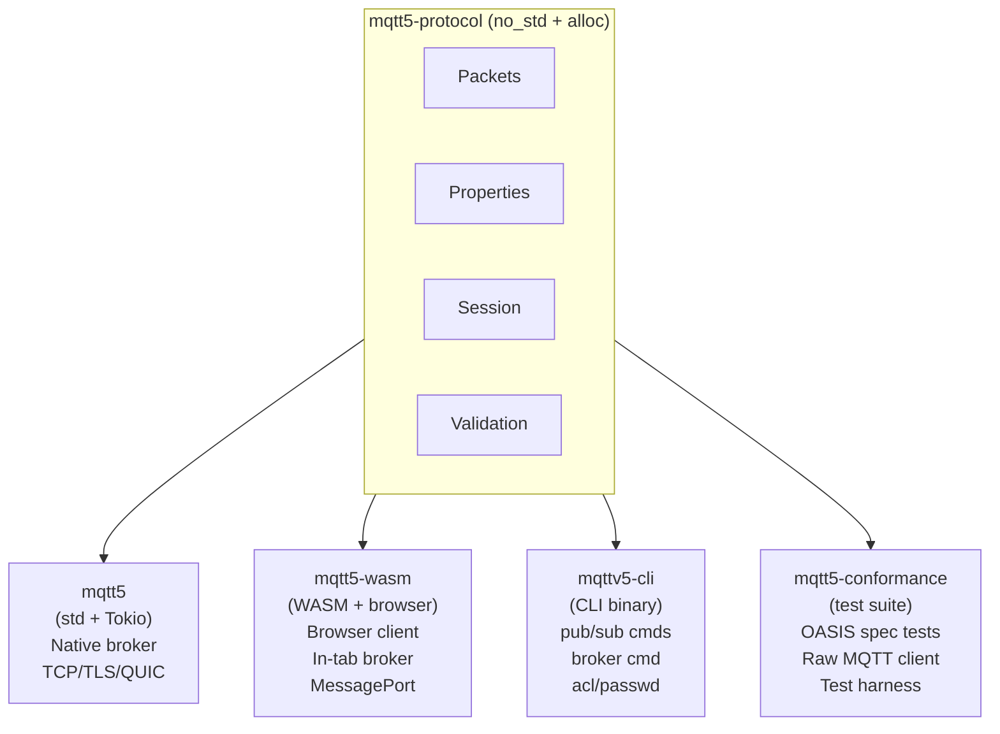
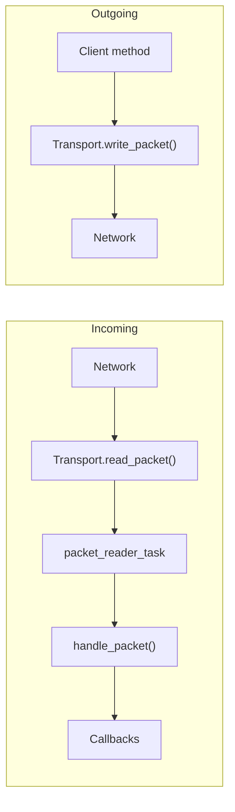
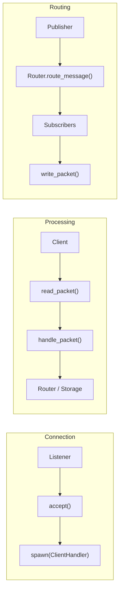
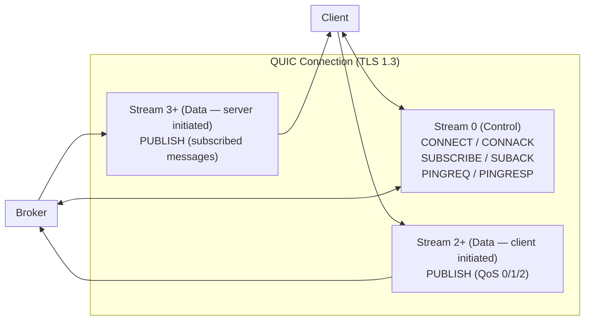
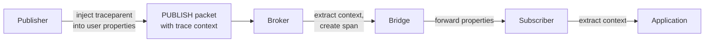

# MQTT v5.0 Platform Architecture

The mqtt5 platform is organized around a single design principle: **keep the protocol core portable, and let each target environment provide its own runtime**. A shared `no_std` protocol crate handles packet parsing, session management, and validation, while three higher-level crates supply the async runtime, transport layer, and platform bindings appropriate for native servers, browser tabs, or command-line tooling.

## Crate Organization

Five crates provide platform-specific implementations sharing a common protocol core:



### mqtt5-protocol (Platform-Agnostic Core)

Platform-agnostic MQTT v5.0 protocol for native, WASM, and embedded targets. Supports `no_std` environments with `alloc`.

The **packet** module defines all MQTT v5.0 packet types (CONNECT, PUBLISH, SUBSCRIBE, etc.), while **encoding** handles binary wire format including variable-length integers, UTF-8 strings, and binary data. Protocol-level concerns live in **protocol/v5**, which provides property accessors and reason codes.

Session management spans several submodules: **flow_control** for QoS pacing, **limits** for connection constraints and message expiry, **queue** for priority-aware message queuing with expiry, **subscription** for subscription state, and **topic_alias** for alias mapping. The **validation** module enforces topic rules, namespace constraints, and shared subscription parsing.

Supporting infrastructure includes **types** (ConnectOptions, PublishOptions, QoS, Message, WillMessage), **bridge** (direction, topic mapping, forwarding evaluation), **connection** (state machine, reconnect config, events), **topic_matching** (MQTT wildcard matching), **error** and **error_classification** (error types and recoverability), **keepalive** (timeout calculation), **flags** (CONNECT/CONNACK/PUBLISH flag parsing), **qos2** (QoS 2 state machine), **packet_id** (identifier management), **transport** (transport trait), **time** (platform-abstracted time for std, WASM, and embedded), and **prelude** (alloc/std compatibility).

| Feature | Description |
|---------|-------------|
| `std` (default) | Full std support with thiserror, tracing |

For single-core targets, use cfg: `rustflags = ["--cfg", "portable_atomic_unsafe_assume_single_core"]`

### mqtt5 (Native)

Full-featured async client and broker for Linux, macOS, Windows. This is the primary crate for production deployments.

The **client** provides `MqttClient` with automatic reconnection and exponential backoff, QoS 0/1/2 with proper flow control, TLS via rustls with CA and client certificate support, QUIC multistream for parallel operations, enhanced authentication (SCRAM-SHA-256, JWT, custom handlers), and connection event callbacks. Additional client modules include **callback** (subscription callback dispatch), **tasks** (background packet reader, keepalive, reconnection), and **types** (ConnectOptions, ConnectionStats).

The **broker** supports multi-transport operation (TCP, TLS, WebSocket, QUIC on different ports), pluggable authentication (password with argon2, certificate, JWT, federated JWT), ACL-based authorization with wildcard topic matching, broker-to-broker bridging with loop prevention, file-based and in-memory storage backends, `$SYS` topics for statistics, session takeover semantics, configuration hot-reload (file watching, SIGHUP via CLI), echo suppression via configurable user property matching, and optional payload codec support (gzip, deflate) behind feature flags. The **session** module extends protocol-level session primitives with async flow control (Tokio semaphores), QUIC stream flow registry, retained message storage, and full session state. Supporting modules include **codec** (payload compression with `CodecRegistry`), **crypto** (TLS certificate verifiers), and optional **OpenTelemetry** integration for distributed tracing.

### mqtt5-wasm (WebAssembly)

Client and broker for browser environments. Published to npm as `mqtt5-wasm`.

```bash
npm install mqtt5-wasm
```

The **WasmMqttClient** exposes a JavaScript Promise API using `Rc<RefCell<T>>` for single-threaded client state. The **WasmBroker** provides a complete in-browser broker using `Arc<RwLock<T>>` for state shared via the Tokio single-threaded runtime. Three transports are available: WebSocket, MessagePort, and BroadcastChannel. Optional payload codecs (gzip, deflate) use `miniz_oxide`.

### mqttv5-cli (Command-Line Tool)

Unified CLI for MQTT operations: `mqttv5 pub` (publish), `mqttv5 sub` (subscribe), `mqttv5 broker` (run broker), `mqttv5 acl` (manage ACLs), `mqttv5 passwd` (manage passwords), `mqttv5 scram` (manage SCRAM credentials), and `mqttv5 bench` (performance benchmarking).

### mqtt5-conformance (Specification Test Suite)

OASIS MQTT v5.0 specification conformance test suite (not published to crates.io). The `RawMqttClient` provides byte-level packet control for protocol edge case testing. A test harness manages broker lifecycle, and manifest-driven organization tracks coverage of the specification's normative statements.

## Embedded Target Support

The protocol crate supports embedded targets via `no_std`:

| Target | Command | Notes |
|--------|---------|-------|
| Cortex-M4 (ARM) | `--target thumbv7em-none-eabihf` | Has hardware atomics |
| RISC-V (atomics) | `--target riscv32imac-unknown-none-elf` | Has atomic extension |
| ESP32-C3 | `--target riscv32imc-unknown-none-elf` | Configure single-core via .cargo/config.toml |

For single-core targets without hardware atomics, add to `.cargo/config.toml`:
```toml
[target.riscv32imc-unknown-none-elf]
rustflags = ["--cfg", "portable_atomic_unsafe_assume_single_core"]
```

Build commands:
```bash
cargo make embedded-cortex-m4   # ARM Cortex-M4
cargo make embedded-riscv       # RISC-V with atomics
cargo make embedded-verify      # All embedded targets
```

## Core Architectural Principle: Direct Async/Await

Every operation in the platform is a direct async function call — no event loops, no command channels, no polling. Tokio provides the async runtime (native), and the resulting code is both simpler to debug and more efficient than channel-based architectures.

## Client Architecture

### Core Components

**MqttClient** is the main client struct. It holds shared state (transport, session, callbacks) behind `Arc<RwLock<T>>` for concurrent access, and exposes direct async methods for all MQTT operations.

The **transport layer** provides async I/O through `read_packet()` and `write_packet()` methods, with implementations for TCP, TLS, WebSocket, and QUIC. Three **background tasks** run concurrently: a packet reader that continuously reads and dispatches incoming packets, a keep-alive task that sends PINGREQ at intervals, and a reconnection task with exponential backoff recovery. **TLS configuration** stores CA certs and client certificates, applied automatically for `mqtts://` URLs with AWS IoT ALPN support.

### Data Flow



### Error Handling

The client validates acknowledgment reason codes: PUBACK (QoS 1) returns `MqttError::PublishFailed(reason_code)` on error, PUBREC/PUBCOMP (QoS 2) validates the complete handshake, and authorization failures surface as `ReasonCode::NotAuthorized` (0x87) from ACL denials.

## Broker Architecture

### Core Components

**MqttBroker** manages configuration and lifecycle, spawning one listening task per transport. **Server listeners** accept connections over TCP (direct `accept()` loop), TLS (rustls with certificate validation), WebSocket (HTTP upgrade with tokio-tungstenite, path enforcement, Origin validation), and QUIC (quinn endpoint with multistream).

Each accepted connection spawns a **ClientHandler** that directly reads and writes packets, manages client session state, and handles the MQTT protocol. The **MessageRouter** performs subscription matching using MQTT-compliant topic wildcards (`+`, `#`), protects system topics (`$SYS/#` excluded from `#`), and supports shared subscriptions (`$share/group/topic`).

The **storage backend** persists sessions, retained messages, queued messages, and inflight messages. The file-based backend uses percent-encoded filenames with atomic writes and fsync; the memory backend stores everything in-process.

### Broker Data Flow



### Authentication System

Authentication is pluggable via the `AuthProvider` trait. Basic providers include **AllowAllAuthProvider** (development), **PasswordAuthProvider** (file-based with argon2 hashing), **CertificateAuthProvider** (TLS peer certificate fingerprint validation, 64-char hex SHA-256), **ComprehensiveAuthProvider** (combines password auth + ACL), **CompositeAuthProvider** (primary/fallback chain), and **RateLimitedAuthProvider** (wraps any provider with rate limiting).

Enhanced authentication mechanisms add **ScramSha256AuthProvider** (SCRAM-SHA-256 without channel binding, rejects concurrent auth for same client ID), **PlainAuthProvider** (PLAIN over TLS with pluggable credential store), **JwtAuthProvider** (JWT with `kid`-based verifier selection, mandatory `exp`/`sub` claims), and **FederatedJwtAuthProvider** (multi-issuer JWT with JWKS auto-refresh and compiled regex claim patterns).

Client-side auth handlers implement the `AuthHandler` trait: **ScramSha256AuthHandler**, **JwtAuthHandler**, and **PlainAuthHandler**. The **MqttClientTrait** enables mock testing via `MockMqttClient`.

Sessions are bound to the authenticated `user_id` (rejects reconnection from a different user), ACLs are re-checked on session restore (pruning unauthorized subscriptions), and the `NoVerification` TLS bypass is restricted to `pub(crate)` scope.

### ACL System

Rule-based access control supports wildcard topic matching, `%u` substitution (expands to the authenticated username in topic patterns, rejecting usernames with `+`, `#`, `/`), separate publish and subscribe permissions, topic name validation on publish (after topic alias resolution), and role-based access control (RBAC). The broker stamps two user properties on every PUBLISH: **x-mqtt-sender** (authenticated user_id) and **x-mqtt-client-id** (publisher's MQTT client_id, anti-spoof stripped). ACL files are managed via `mqttv5 acl add/remove/list/check`.

### Bridge Manager

Bridges create broker-to-broker connections where each bridge acts as a client to a remote broker. Topic mappings with prefix transformation control which messages flow in which direction, and loop prevention via bridge headers stops message cycles. Bridges support TLS/mTLS with AWS IoT integration and reconnect with exponential backoff.

### Load Balancer (Server Redirect)

The broker can act as a pure connection redirector for horizontal scaling. When `load_balancer` is configured, the broker never handles MQTT traffic — it only redirects clients to a backend.

On each CONNECT, the broker hashes the client ID (byte-sum modulo backend count) to deterministically select a backend. It responds with a CONNACK containing reason code `UseAnotherServer` (0x9C) and a `ServerReference` property set to the backend URL. The client parses the URL and reconnects directly to the backend.

The client-side redirect loop in `connect_internal()` follows up to 3 hops. The URL scheme in `ServerReference` determines the transport for the backend connection: `mqtt://` for TCP, `mqtts://` for TLS, `quic://` for QUIC.

```rust
BrokerConfig::default()
    .with_load_balancer(LoadBalancerConfig::new(vec![
        "mqtt://backend1:1883".into(),
        "mqtt://backend2:1883".into(),
    ]))
```

### Resource Monitor

The resource monitor tracks connections, bandwidth, and messages, enforcing rate limits and quotas through direct checks rather than monitoring loops.

### Event Hooks

Custom event handlers via `BrokerEventHandler` trait:

| Hook | Event Type | Trigger |
|------|------------|---------|
| `on_client_connect` | `ClientConnectEvent` | Client CONNECT packet accepted |
| `on_client_subscribe` | `ClientSubscribeEvent` | Client SUBSCRIBE processed |
| `on_client_unsubscribe` | `ClientUnsubscribeEvent` | Client UNSUBSCRIBE processed |
| `on_client_publish` | `ClientPublishEvent` -> `PublishAction` | Client PUBLISH received (includes `user_id`, `response_topic`, `correlation_data`); returns `Continue`, `Handled`, or `Transform(PublishPacket)` |
| `on_client_disconnect` | `ClientDisconnectEvent` | Client disconnects (clean or unexpected) |
| `on_retained_set` | `RetainedSetEvent` | Retained message stored or cleared |
| `on_message_delivered` | `MessageDeliveredEvent` | QoS 1/2 message delivered to subscriber |

Usage: `BrokerConfig::default().with_event_handler(Arc::new(handler))`

## QUIC Transport Architecture

QUIC provides MQTT over QUIC (RFC 9000) with multistream support. A single QUIC connection carries a persistent control stream for session management alongside separate data streams for publish traffic.



### Stream Strategies

Three strategies control how MQTT packets map to QUIC streams. **ControlOnly** uses a single bidirectional stream (traditional MQTT behavior). **DataPerPublish** opens a new stream per QoS 1/2 publish for maximum parallelism. **DataPerTopic** pools streams by topic with LRU caching for topic isolation without per-message overhead. `DataPerSubscription` is deprecated (architecturally identical to `DataPerTopic`).

### Connection Migration

QUIC connections survive network address changes (WiFi to cellular, IP reassignment). On the **server side**, `ClientHandler::check_quic_migration()` polls `Connection::remote_address()` after each packet and atomically updates per-IP tracking on change. On the **client side**, `MqttClient::migrate()` calls `Endpoint::rebind()` with a new UDP socket — all streams, sessions, and subscriptions remain valid.

### Benefits

- No head-of-line blocking
- Parallel QoS flows
- Built-in TLS 1.3
- Connection migration for mobile clients

## WASM Architecture

Browser environments require different concurrency primitives and transport mechanisms than native platforms.

### Adaptations for Browser

The **client** uses `Rc<RefCell<T>>` for single-threaded state, while the **broker** uses `Arc<RwLock<T>>` (shared via Tokio single-threaded runtime). An async bridge converts Rust futures to JavaScript Promises. File I/O is unavailable, so all storage is memory-only. Browser TLS (`wss://`) is handled by the browser's WebSocket implementation.

### WASM Client

```rust
pub struct WasmMqttClient {
    state: Rc<RefCell<ClientState>>
}
```

- Connection: `connect(url)`, `connect_message_port(port)`, `connect_broadcast_channel(name)`
- Publishing: `publish()`, `publish_qos1()`, `publish_qos2()`
- Subscription: `subscribe_with_callback(topic, callback)`
- Events: `on_connect()`, `on_disconnect()`, `on_error()`, `on_connectivity_change()`

### WASM Broker

The in-browser broker provides full MQTT v5.0 protocol support over MessagePort (for in-tab clients) with memory-only storage. `create_client_port()` creates a MessageChannel for direct client connections. Bridge support via `WasmBridgeManager` includes loop prevention.

### Browser Transports

Three transport types serve different deployment scenarios. **WebSocket** connects to an external broker via `web_sys::WebSocket`. **MessagePort** communicates with an in-tab broker at zero network overhead. **BroadcastChannel** enables cross-tab messaging between browser windows.

## Telemetry (Optional)

OpenTelemetry integration (behind the `opentelemetry` feature flag) provides end-to-end distributed tracing across the publish-subscribe pipeline.



Configuration via `TelemetryConfig` and `BrokerConfig::with_opentelemetry()`.

## Testing Architecture

The platform uses a layered testing strategy. **Unit tests** exercise individual components directly. **Integration tests** run full client-broker interactions with real connections. **Turmoil tests** (behind the `turmoil-testing` feature) simulate network failures. **Property tests** via proptest verify protocol invariants across random inputs. **Conformance tests** in the mqtt5-conformance crate validate OASIS MQTT v5.0 specification compliance using a raw MQTT client for precise packet control.
