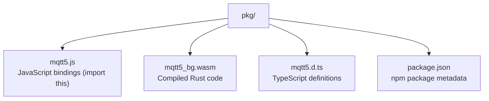

# Using mqtt5 WASM Client and Broker in JavaScript Applications

This guide explains how to use the mqtt5 MQTT client and in-tab broker in any JavaScript application (vanilla JS, React, Vue, etc.).

## What You Get

When you build the WASM package, you get these files in `pkg/`:



You only need to import `mqtt5.js` - it automatically loads the WASM file.

## Building the WASM Package

```bash
# Install wasm-pack (one time)
curl https://rustwasm.github.io/wasm-pack/installer/init.sh -sSf | sh

# Build client only
wasm-pack build crates/mqtt5-wasm --target web --features client

# Build client + in-tab broker
wasm-pack build crates/mqtt5-wasm --target web --features client,broker

# Build client + broker + payload compression codecs
wasm-pack build crates/mqtt5-wasm --target web --features client,broker,codec

# Output is in crates/mqtt5-wasm/pkg/
```

## Basic Usage

### In-Tab Broker (No External Dependencies)

Run a complete MQTT broker inside your browser tab:

```html
<!DOCTYPE html>
<html>
<head>
    <title>MQTT In-Tab Broker</title>
</head>
<body>
    <script type="module">
        import init, { Broker, MqttClient } from './pkg/mqtt5.js';

        async function main() {
            await init();

            const broker = new Broker();

            const client = new MqttClient('local-client');

            const port = broker.createClientPort();
            await client.connectMessagePort(port);

            await client.subscribeWithCallback('test/topic', (topic, payload, properties) => {
                const decoder = new TextDecoder();
                console.log('Received:', topic, decoder.decode(payload));
                if (properties.responseTopic) {
                    console.log('Response topic:', properties.responseTopic);
                }
            });

            const encoder = new TextEncoder();
            await client.publish('test/topic', encoder.encode('Hello from in-tab broker!'));
        }

        main().catch(console.error);
    </script>
</body>
</html>
```

### External WebSocket Broker

Connect to a remote MQTT broker over WebSocket:

```html
<!DOCTYPE html>
<html>
<head>
    <title>MQTT Client</title>
</head>
<body>
    <script type="module">
        import init, { MqttClient } from './pkg/mqtt5.js';

        async function main() {
            await init();

            const client = new MqttClient('my-client-id');
            await client.connect('ws://broker.hivemq.com:8000/mqtt');

            await client.subscribeWithCallback('test/topic', (topic, payload, properties) => {
                const decoder = new TextDecoder();
                console.log('Received:', decoder.decode(payload));
            });

            const payload = new TextEncoder().encode('Hello MQTT');
            await client.publish('test/topic', payload);
        }

        main().catch(console.error);
    </script>
</body>
</html>
```

**Important:** You need a web server - WASM won't work with `file://` URLs.

```bash
# Simple web server
python3 -m http.server 8000
# or
npx serve
```

### React

```bash
# Copy pkg/ to your project
cp -r crates/mqtt5-wasm/pkg/ src/mqtt5/
```

**src/mqtt.js**
```javascript
import init, { MqttClient } from './mqtt5/mqtt5.js';

let initialized = false;

export async function createMqttClient(clientId) {
    if (!initialized) {
        await init();
        initialized = true;
    }
    return new MqttClient(clientId);
}
```

**Component usage:**
```javascript
import { useEffect, useState } from 'react';
import { createMqttClient } from './mqtt';

function MyComponent() {
    const [client, setClient] = useState(null);
    const [connected, setConnected] = useState(false);

    useEffect(() => {
        let mqttClient;

        async function connect() {
            mqttClient = await createMqttClient('react-client');
            await mqttClient.connect('ws://broker.hivemq.com:8000/mqtt');
            setClient(mqttClient);
            setConnected(true);
        }

        connect();

        return () => {
            if (mqttClient) {
                mqttClient.disconnect();
            }
        };
    }, []);

    async function handlePublish() {
        if (!client) return;
        const payload = new TextEncoder().encode('Hello from React');
        await client.publish('react/topic', payload);
    }

    return (
        <div>
            <p>Status: {connected ? 'Connected' : 'Disconnected'}</p>
            <button onClick={handlePublish}>Publish</button>
        </div>
    );
}
```

### Vue 3

```javascript
import { ref, onMounted, onUnmounted } from 'vue';
import init, { MqttClient } from './mqtt5/mqtt5.js';

export default {
    setup() {
        const client = ref(null);
        const connected = ref(false);

        onMounted(async () => {
            await init();
            client.value = new MqttClient('vue-client');
            await client.value.connect('ws://broker.hivemq.com:8000/mqtt');
            connected.value = true;
        });

        onUnmounted(() => {
            if (client.value) {
                client.value.disconnect();
            }
        });

        async function publish() {
            const payload = new TextEncoder().encode('Hello from Vue');
            await client.value.publish('vue/topic', payload);
        }

        return { connected, publish };
    }
};
```

## Available Methods

### MqttClient API

The JavaScript class is exported as `MqttClient` (Rust type: `WasmMqttClient`).

#### Construction

```javascript
const client = new MqttClient(clientId);
```

#### Connection

```javascript
await client.connect(url);

await client.connectWithOptions(url, connectOptions);

await client.connectMessagePort(port);

await client.connectMessagePortWithOptions(port, connectOptions);

await client.connectBroadcastChannel(channelName);

await client.disconnect();

client.isConnected();
// Returns: boolean

client.isBrowserOnline();
// Returns: boolean (navigator.onLine state)

client.destroy();
```

#### Publishing

```javascript
await client.publish(topic, payloadBytes);

await client.publishWithOptions(topic, payloadBytes, publishOptions);

const packetId = await client.publishQos1(topic, payloadBytes, callback);
// callback(reasonCode) called when PUBACK received

const packetId = await client.publishQos2(topic, payloadBytes, callback);
// callback(reasonCode) called when PUBCOMP received
```

#### Subscribing

```javascript
const packetId = await client.subscribe(topic);

const packetId = await client.subscribeWithCallback(topic, callback);
// callback(topic, payload, properties) called for each matching message

const packetId = await client.subscribeWithOptions(topic, callback, subscribeOptions);
// Same callback signature, with advanced subscription options
// Rejects if broker returns reason code >= 0x80

const packetId = await client.unsubscribe(topic);
```

#### Enhanced Authentication

```javascript
client.respondAuth(authData);
```

#### Reconnection

```javascript
client.setReconnectOptions(reconnectOptions);

client.enableAutoReconnect(enabled);

client.isReconnecting();
// Returns: boolean
```

#### Event Callbacks

```javascript
client.onConnect((reasonCode, sessionPresent) => {
    console.log('Connected!', reasonCode, sessionPresent);
});

client.onDisconnect(() => {
    console.log('Disconnected');
});

client.onError((error) => {
    console.error('Error:', error);
});

client.onAuthChallenge((method, data) => {
    // method: string (authentication method name)
    // data: Uint8Array | null (challenge data from broker)
    const response = computeResponse(method, data);
    client.respondAuth(response);
});

client.onReconnecting((attempt, delayMs) => {
    console.log(`Reconnect attempt ${attempt}, next retry in ${delayMs}ms`);
});

client.onReconnectFailed((error) => {
    console.error('All reconnect attempts failed:', error);
});

client.onConnectivityChange((online) => {
    console.log('Browser online:', online);
});
```

### Broker API

The JavaScript class is exported as `Broker` (Rust type: `WasmBroker`).

#### Construction

```javascript
const broker = new Broker();

const config = new BrokerConfig();
config.maxClients = 500;
config.allowAnonymous = true;
const broker = Broker.withConfig(config);
```

#### Client Ports

```javascript
const port = broker.createClientPort();
// Returns: MessagePort for client to connect via connectMessagePort()
```

#### User Management

```javascript
broker.addUser('alice', 'password123');

broker.addUserWithHash('bob', hashedPassword);

broker.removeUser('alice');
// Returns: boolean (true if user existed)

broker.hasUser('alice');
// Returns: boolean

broker.userCount();
// Returns: number

const hash = Broker.hashPassword('password123');
// Returns: string (static method)
```

#### ACL (Access Control Lists)

```javascript
await broker.addAclRule('alice', 'sensors/#', 'read');
// permission: 'read', 'write', 'readwrite', 'deny'

await broker.clearAclRules();

const count = await broker.aclRuleCount();

await broker.setAclDefaultDeny();

await broker.setAclDefaultAllow();
```

#### Role-Based Access Control

```javascript
await broker.addRole('admin');

await broker.removeRole('admin');
// Returns: boolean

const roles = await broker.listRoles();
// Returns: string[]

const count = await broker.roleCount();

await broker.addRoleRule('admin', 'system/#', 'readwrite');

await broker.assignRole('alice', 'admin');

await broker.unassignRole('alice', 'admin');
// Returns: boolean

const userRoles = await broker.getUserRoles('alice');
// Returns: string[]

await broker.clearRoles();
```

#### Configuration

```javascript
const newConfig = new BrokerConfig();
newConfig.maxClients = 2000;
broker.updateConfig(newConfig);

broker.getConfigHash();
// Returns: number

broker.getMaxClients();
// Returns: number

broker.getMaxPacketSize();
// Returns: number

broker.getSessionExpiryIntervalSecs();
// Returns: number
```

#### System Topics ($SYS)

```javascript
broker.startSysTopics();
// Publishes $SYS topics every 10 seconds

broker.startSysTopicsWithIntervalSecs(30);
// Custom interval

broker.stopSysTopics();
```

#### Bridging

```javascript
const bridgeConfig = new BridgeConfig('my-bridge');
bridgeConfig.clientId = 'bridge-client';
bridgeConfig.cleanStart = true;
bridgeConfig.keepAliveSecs = 60;
bridgeConfig.username = 'bridge-user';
bridgeConfig.password = 'bridge-pass';
bridgeConfig.loopPreventionTtlSecs = 300;
bridgeConfig.loopPreventionCacheSize = 10000;

const mapping = new TopicMapping('sensors/#', BridgeDirection.Both);
mapping.qos = 1;
mapping.localPrefix = 'local/';
mapping.remotePrefix = 'remote/';
bridgeConfig.addTopic(mapping);

await broker.addBridge(bridgeConfig, remotePort);

await broker.addBridgeWebSocket(bridgeConfig, 'ws://remote-broker:8000/mqtt', connectOptions);

await broker.removeBridge('my-bridge');

const bridges = broker.listBridges();
// Returns: string[]

await broker.stopAllBridges();
```

#### Broker Event Callbacks

All broker events receive a single object argument with named properties.

```javascript
broker.onClientConnect((event) => {
    // event.clientId: string
    // event.cleanStart: boolean
    console.log(`Client connected: ${event.clientId}`);
});

broker.onClientDisconnect((event) => {
    // event.clientId: string
    // event.reason: string
    // event.unexpected: boolean
    console.log(`Client disconnected: ${event.clientId}, reason: ${event.reason}`);
});

broker.onClientPublish((event) => {
    // event.clientId: string
    // event.topic: string
    // event.qos: number
    // event.retain: boolean
    // event.payloadSize: number
    console.log(`${event.clientId} published to ${event.topic}`);
});

broker.onClientSubscribe((event) => {
    // event.clientId: string
    // event.subscriptions: Array<{topic: string, qos: number}>
    console.log(`${event.clientId} subscribed to ${event.subscriptions.length} topics`);
});

broker.onClientUnsubscribe((event) => {
    // event.clientId: string
    // event.topics: string[]
    console.log(`${event.clientId} unsubscribed from ${event.topics.join(', ')}`);
});

broker.onMessageDelivered((event) => {
    // event.clientId: string
    // event.packetId: number
    // event.qos: number
    console.log(`Message ${event.packetId} delivered to ${event.clientId}`);
});

broker.onConfigChange((oldHash, newHash) => {
    console.log(`Config changed: ${oldHash} -> ${newHash}`);
});
```

### BrokerConfig API

The JavaScript class is exported as `BrokerConfig` (Rust type: `WasmBrokerConfig`).

```javascript
const config = new BrokerConfig();

config.maxClients = 1000;                       // default: 1000
config.sessionExpiryIntervalSecs = 3600;        // default: 3600
config.maxPacketSize = 268435456;               // default: 268435456 (256MB)
config.topicAliasMaximum = 65535;               // default: 65535
config.retainAvailable = true;                  // default: true
config.maximumQos = 2;                          // default: 2 (0, 1, or 2)
config.wildcardSubscriptionAvailable = true;    // default: true
config.subscriptionIdentifierAvailable = true;  // default: true
config.sharedSubscriptionAvailable = true;      // default: true
config.serverKeepAliveSecs = 120;               // default: null (use client value)
config.allowAnonymous = false;                  // default: false
config.maxOutboundRatePerClient = 0;            // default: 0 (unlimited)

config.changeOnlyDeliveryEnabled = true;
config.addChangeOnlyDeliveryPattern('sensors/#');
config.clearChangeOnlyDeliveryPatterns();

config.echoSuppressionEnabled = true;
config.echoSuppressionPropertyKey = 'x-origin-client-id';
// default key when enabled: 'x-origin-client-id'
```

### ConnectOptions API

The JavaScript class is exported as `ConnectOptions` (Rust type: `WasmConnectOptions`).

```javascript
const opts = new ConnectOptions();

opts.keepAlive = 60;                       // default: 60 seconds
opts.cleanStart = true;                    // default: true
opts.username = 'alice';                   // default: null
opts.set_password(encoder.encode('pw'));   // accepts Uint8Array
opts.protocolVersion = 5;                  // 4 (v3.1.1) or 5 (v5.0), default: 5
opts.sessionExpiryInterval = 3600;         // default: null
opts.receiveMaximum = 65535;               // default: null
opts.maximumPacketSize = 1048576;          // default: null
opts.topicAliasMaximum = 10;              // default: null
opts.requestResponseInformation = true;    // default: null
opts.requestProblemInformation = true;     // default: null
opts.authenticationMethod = 'SCRAM-SHA-256';  // default: null
opts.set_authenticationData(data);         // accepts Uint8Array

opts.addUserProperty('key', 'value');
opts.clearUserProperties();

opts.addBackupUrl('ws://backup-broker:8000/mqtt');
opts.clearBackupUrls();
opts.getBackupUrls();
// Returns: string[]

const will = new WillMessage('client/status', encoder.encode('offline'));
will.qos = 1;
will.retain = true;
opts.setWill(will);
opts.clearWill();

// With codec feature
opts.setCodecRegistry(registry);
opts.clearCodecRegistry();

await client.connectWithOptions('ws://broker:8000/mqtt', opts);
```

### PublishOptions API

The JavaScript class is exported as `PublishOptions` (Rust type: `WasmPublishOptions`).

```javascript
const opts = new PublishOptions();

opts.qos = 1;                             // 0, 1, or 2; default: 0
opts.retain = true;                       // default: false
opts.payloadFormatIndicator = true;       // default: null (true = UTF-8)
opts.messageExpiryInterval = 60;          // default: null (seconds)
opts.topicAlias = 1;                      // default: null
opts.responseTopic = 'reply/topic';       // default: null
opts.set_correlationData(data);           // accepts Uint8Array
opts.contentType = 'application/json';    // default: null

opts.addUserProperty('key', 'value');
opts.clearUserProperties();

await client.publishWithOptions('my/topic', payload, opts);
```

### SubscribeOptions API

The JavaScript class is exported as `SubscribeOptions` (Rust type: `WasmSubscribeOptions`).

```javascript
const opts = new SubscribeOptions();

opts.qos = 1;                    // 0, 1, or 2; default: 0
opts.noLocal = true;             // default: false (don't receive own messages)
opts.retainAsPublished = true;   // default: false
opts.retainHandling = 0;         // 0=send at subscribe, 1=send if new, 2=don't send; default: 0
opts.subscriptionIdentifier = 42; // default: null

await client.subscribeWithOptions('my/topic', callback, opts);
```

### WillMessage API

The JavaScript class is exported as `WillMessage` (Rust type: `WasmWillMessage`).

```javascript
const will = new WillMessage(topic, payloadBytes);

will.topic = 'client/status';
will.qos = 1;                          // 0, 1, or 2; default: 0
will.retain = true;                    // default: false
will.willDelayInterval = 60;           // default: null (seconds)
will.messageExpiryInterval = 3600;     // default: null (seconds)
will.contentType = 'text/plain';       // default: null
will.responseTopic = 'reply/topic';    // default: null
```

### ReconnectOptions API

The JavaScript class is exported as `ReconnectOptions` (Rust type: `WasmReconnectOptions`).

```javascript
const opts = new ReconnectOptions();

opts.enabled = true;              // default: true
opts.initialDelayMs = 1000;       // default: 1000
opts.maxDelayMs = 60000;          // default: 60000
opts.backoffFactor = 2.0;         // default: 2.0
opts.maxAttempts = 20;            // default: 20, null for unlimited

const disabled = ReconnectOptions.disabled();

client.setReconnectOptions(opts);
```

### MessageProperties API

The JavaScript class is exported as `MessageProperties` (Rust type: `WasmMessageProperties`). This is passed as the third argument to subscription callbacks.

```javascript
await client.subscribeWithCallback('test/#', (topic, payload, properties) => {
    properties.responseTopic;           // string | null
    properties.correlationData;         // Uint8Array | null
    properties.contentType;             // string | null
    properties.payloadFormatIndicator;  // boolean | null
    properties.messageExpiryInterval;   // number | null
    properties.subscriptionIdentifiers; // number[]
    properties.getUserProperties();     // Array<[string, string]>
});
```

### BridgeConfig API

The JavaScript class is exported as `BridgeConfig` (Rust type: `WasmBridgeConfig`).

```javascript
const config = new BridgeConfig('bridge-name');

config.clientId = 'bridge-client-1';        // default: 'bridge-{name}'
config.cleanStart = true;                   // default: true
config.keepAliveSecs = 60;                  // default: 60
config.username = 'bridge-user';            // default: null
config.password = 'bridge-pass';            // default: null
config.loopPreventionTtlSecs = 300;        // default: 0 (disabled)
config.loopPreventionCacheSize = 10000;     // default: 10000

const mapping = new TopicMapping('sensors/#', BridgeDirection.In);
config.addTopic(mapping);
config.validate();
```

### TopicMapping API

The JavaScript class is exported as `TopicMapping` (Rust type: `WasmTopicMapping`).

```javascript
const mapping = new TopicMapping(pattern, direction);

mapping.qos = 1;                    // 0, 1, or 2; default: 0
mapping.localPrefix = 'local/';     // default: null
mapping.remotePrefix = 'remote/';   // default: null
```

### BridgeDirection Enum

```javascript
BridgeDirection.In    // Remote -> Local only
BridgeDirection.Out   // Local -> Remote only
BridgeDirection.Both  // Bidirectional
```

## Transport Types Explained

### 1. WebSocket (External Broker)

Connect to external MQTT broker over WebSocket.

**Use when:** You have a broker running somewhere (cloud, local network)

```javascript
const client = new MqttClient('my-client-id');
await client.connect('ws://broker.example.com:8000/mqtt');
```

**Broker URL format:**
- `ws://host:port/path` - Unencrypted
- `wss://host:port/path` - TLS encrypted (production)

**Free public brokers:**
- `ws://broker.hivemq.com:8000/mqtt`
- `ws://test.mosquitto.org:8080`
- `ws://broker.emqx.io:8083/mqtt`

### 2. MessagePort (In-Tab Broker)

Run complete MQTT broker in browser tab, client connects via MessagePort.

**Use when:** Testing, demos, offline apps, no external broker needed

```javascript
const broker = new Broker();
const client = new MqttClient('local-client');

const port = broker.createClientPort();
await client.connectMessagePort(port);
```

**Features:**
- Full MQTT v5.0 support (QoS 0/1/2, retained messages, subscriptions)
- Memory-only storage (no persistence)
- Configurable authentication (allow anonymous or add users)
- Bridging to remote brokers

See `crates/mqtt5-wasm/examples/local-broker/` for complete implementation.

### 3. BroadcastChannel (Cross-Tab Communication)

Connect clients across browser tabs or iframes using the BroadcastChannel API.

**Use when:** Multiple tabs need to share an MQTT connection, or you need cross-tab pub/sub

```javascript
const client = new MqttClient('tab-client');
await client.connectBroadcastChannel('mqtt-channel');
```

**How it works:**
- Uses the browser's `BroadcastChannel` API for inter-tab messaging
- All tabs joined to the same channel name can exchange MQTT packets
- Requires one tab to run a broker that listens on the same channel

**Tab running the broker:**
```javascript
const broker = new Broker();
const localClient = new MqttClient('broker-tab');
const port = broker.createClientPort();
await localClient.connectMessagePort(port);
```

**Other tabs:**
```javascript
const client = new MqttClient('other-tab');
await client.connectBroadcastChannel('mqtt-channel');
```

## Payload Compression (Codec Feature)

When built with the `codec` feature, the client supports transparent payload compression and decompression using MQTT v5.0 content type properties.

### Setup

```javascript
import init, { MqttClient, ConnectOptions, CodecRegistry,
               GzipCodec, DeflateCodec,
               createCodecRegistry, createGzipCodec, createDeflateCodec
             } from './pkg/mqtt5.js';

const registry = new CodecRegistry();

const gzip = new GzipCodec();
// or with options: createGzipCodec(6, 128)
registry.registerGzip(gzip);

const deflate = new DeflateCodec();
// or with options: createDeflateCodec(6, 128)
registry.registerDeflate(deflate);

registry.setDefault('application/gzip');

const opts = new ConnectOptions();
opts.setCodecRegistry(registry);

await client.connectWithOptions('ws://broker:8000/mqtt', opts);
```

### GzipCodec

```javascript
const codec = new GzipCodec();
// Content type: 'application/gzip'

codec.withLevel(6);             // Compression level 1-9, default: 6
codec.withMinSize(128);         // Min payload size to compress, default: 128 bytes
codec.withMaxDecompressedSize(10485760); // Max decompressed size, default: 10MB
```

### DeflateCodec

```javascript
const codec = new DeflateCodec();
// Content type: 'application/x-deflate'

codec.withLevel(6);             // Compression level 1-9, default: 6
codec.withMinSize(128);         // Min payload size to compress, default: 128 bytes
codec.withMaxDecompressedSize(10485760); // Max decompressed size, default: 10MB
```

### CodecRegistry

```javascript
const registry = new CodecRegistry();

registry.registerGzip(gzipCodec);
registry.registerDeflate(deflateCodec);
registry.setDefault('application/gzip');
registry.getDefault();      // Returns: string | null
registry.hasCodec('application/gzip');  // Returns: boolean
```

### Factory Functions

```javascript
const registry = createCodecRegistry();
const gzip = createGzipCodec(6, 128);      // (level?, minSize?)
const deflate = createDeflateCodec(6, 128); // (level?, minSize?)
```

## Working with Messages

### Encoding/Decoding Payloads

MQTT payloads are byte arrays. JavaScript uses `TextEncoder`/`TextDecoder`:

```javascript
const encoder = new TextEncoder();
const payload = encoder.encode('Hello World');
await client.publish('test/topic', payload);

const data = { temperature: 25.5, humidity: 60 };
const jsonPayload = encoder.encode(JSON.stringify(data));
await client.publish('sensors/data', jsonPayload);

const decoder = new TextDecoder();
await client.subscribeWithCallback('sensors/data', (topic, payload, properties) => {
    const text = decoder.decode(payload);
    const json = JSON.parse(text);
    console.log('Temperature:', json.temperature);
});
```

## Common Patterns

### Auto-Reconnect

```javascript
const reconnectOpts = new ReconnectOptions();
reconnectOpts.initialDelayMs = 1000;
reconnectOpts.maxDelayMs = 30000;
reconnectOpts.backoffFactor = 2.0;
reconnectOpts.maxAttempts = 10;

client.setReconnectOptions(reconnectOpts);

client.onReconnecting((attempt, delayMs) => {
    console.log(`Reconnect attempt ${attempt}, waiting ${delayMs}ms`);
});

client.onReconnectFailed((error) => {
    console.error('Reconnection gave up:', error);
});
```

### Request-Response Pattern

```javascript
async function request(client, topic, payload, timeout = 5000) {
    const responseTopic = `response/${crypto.randomUUID()}`;
    const encoder = new TextEncoder();

    return new Promise(async (resolve, reject) => {
        const timer = setTimeout(() => {
            client.unsubscribe(responseTopic);
            reject(new Error('Request timeout'));
        }, timeout);

        await client.subscribeWithCallback(responseTopic, (topic, payload, properties) => {
            clearTimeout(timer);
            client.unsubscribe(responseTopic);
            resolve({ topic, payload, properties });
        });

        const opts = new PublishOptions();
        opts.responseTopic = responseTopic;
        opts.set_correlationData(encoder.encode(crypto.randomUUID()));
        await client.publishWithOptions(topic, encoder.encode(payload), opts);
    });
}
```

### Graceful Shutdown

```javascript
window.addEventListener('beforeunload', async (event) => {
    if (client && client.isConnected()) {
        await client.disconnect();
    }
});
```

### Authenticated Broker

```javascript
const config = new BrokerConfig();
config.allowAnonymous = false;

const broker = Broker.withConfig(config);
broker.addUser('alice', 'secret123');

await broker.addAclRule('alice', 'sensors/#', 'readwrite');
await broker.addAclRule('alice', 'admin/#', 'deny');

const port = broker.createClientPort();
const opts = new ConnectOptions();
opts.username = 'alice';
opts.set_password(new TextEncoder().encode('secret123'));

await client.connectMessagePortWithOptions(port, opts);
```

### Broker Bridging

```javascript
const localBroker = new Broker();
const remoteBroker = new Broker();

const bridgeConfig = new BridgeConfig('local-to-remote');
const mapping = new TopicMapping('sensors/#', BridgeDirection.Out);
mapping.localPrefix = 'local/';
bridgeConfig.addTopic(mapping);

const remotePort = remoteBroker.createClientPort();
await localBroker.addBridge(bridgeConfig, remotePort);
```

## Bundler Configuration

### Vite

```javascript
// vite.config.js
export default {
    build: {
        target: 'esnext'
    },
    optimizeDeps: {
        exclude: ['mqtt5']
    }
};
```

Copy `pkg/` to `public/mqtt5/` or import directly if in `src/`.

### Webpack

```javascript
// webpack.config.js
module.exports = {
    experiments: {
        asyncWebAssembly: true
    }
};
```

### Create React App

CRA doesn't support WASM easily. Either:
1. Eject and configure webpack
2. Use `public/` folder for pkg files
3. Use Vite instead

## Browser Support

- Chrome/Edge 90+
- Firefox 88+
- Safari 15.4+
- Internet Explorer is not supported (no WASM)

## Deployment Checklist

1. **MIME Types**: Server must serve `.wasm` files with `application/wasm`
2. **CORS**: If WASM and HTML on different domains, configure CORS
3. **HTTPS**: Production should use `wss://` (encrypted WebSocket)
4. **Bundle Size**: `mqtt5_bg.wasm` is ~90KB (optimized)
5. **Caching**: Set long cache headers for `.wasm` files (they're versioned)

## Troubleshooting

**"Failed to fetch WASM"**
- Ensure web server is running (not `file://`)
- Check browser console for 404 errors
- Verify `mqtt5_bg.wasm` exists in same directory as `mqtt5.js`

**"Cannot read properties of undefined"**
- Did you call `await init()` before creating client?
- Check if WASM initialization succeeded

**"Connection failed"**
- Verify broker URL (ws:// or wss://)
- Check broker is accessible (try in MQTT client first)
- Check browser console for CORS errors

**"Module not found"**
- Import path must be correct: `from './pkg/mqtt5.js'`
- Use relative paths, not node-style imports

## WASM Limitations

The WASM build has constraints compared to the native Rust library:

### Transport Limitations
- **No TLS socket support**: Browser security prevents raw TLS. Use browser-managed `wss://`
- **WebSocket only for external brokers**: Must use WebSocket transport
- **MessagePort for in-tab broker**: Communication within same browser tab
- **BroadcastChannel for cross-tab**: Communication between browser tabs

### Storage Limitations
- **Memory-only storage**: No file persistence in browser
- **Session data lost on reload**: All broker state is transient

### Authentication Limitations
- **In-tab broker defaults to deny anonymous**: Set `allowAnonymous = true` on BrokerConfig or add users with `addUser()`

### Network Limitations
- **No server sockets**: Cannot listen for incoming connections
- **No file-based configuration**: All config must be programmatic

These limitations are inherent to the browser sandbox security model.

## Next Steps

- See `crates/mqtt5-wasm/examples/` for all browser examples
- See `crates/mqtt5-wasm/examples/README.md` for example descriptions
- Read [MQTT v5.0 spec](https://docs.oasis-open.org/mqtt/mqtt/v5.0/mqtt-v5.0.html) for protocol details

## TypeScript Support

TypeScript definitions are included in `pkg/mqtt5.d.ts`:

```typescript
import init, { MqttClient, ConnectOptions, PublishOptions } from './mqtt5/mqtt5.js';

async function example(): Promise<void> {
    await init();
    const client = new MqttClient('ts-client');

    const opts = new ConnectOptions();
    opts.keepAlive = 30;

    await client.connectWithOptions('ws://broker.example.com:8000/mqtt', opts);

    const pubOpts = new PublishOptions();
    pubOpts.qos = 1;
    pubOpts.retain = true;

    const payload: Uint8Array = new TextEncoder().encode('Hello');
    await client.publishWithOptions('test/topic', payload, pubOpts);

    await client.subscribeWithCallback('test/topic', (topic, payload, properties) => {
        console.log('Received on', topic);
    });
}
```
